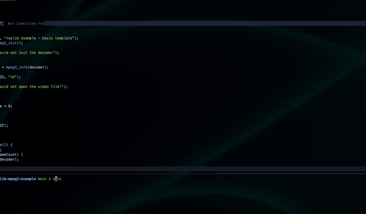

## raylib-mpeg2-examle

This project is about playing video to Raylib using [libmpeg2](https://libmpeg2.sourceforge.io/)
for decoding.

<div align="center">
  
</div>

### Project Setup for macOS and Linux

This document outlines the steps to set up the development environment for the project on both macOS and Linux. (haven't tested on linux yet)

### Prerequisites

#### macOS

1. **Install Homebrew** (if not already installed):

   ```bash
   /bin/bash -c "$(curl -fsSL https://raw.githubusercontent.com/Homebrew/install/HEAD/install.sh)"
   ```

2. Install Dependencies:

   ```bash
   brew install libmpeg2 raylib
   ```

#### Linux

1. Install Dependencies:

```bash
sudo apt update
sudo apt install build-essential libmpeg2-4-dev libgl1-mesa-dev libraylib-dev pkg-config
```

### Setting Up the Project

```bash
git clone https://github.com/kaandesu/raylib-mpeg2-examle
cd raylib-mpeg2-examle

make
# "make build" to only build without running

```

### Notes

- Ensure that `pkg-config` is installed on both macOS and Linux, as it is used to manage library compile and link flags.

- On macOS, make sure you have the Xcode command line tools installed:

```bash
xcode-select --install
```
